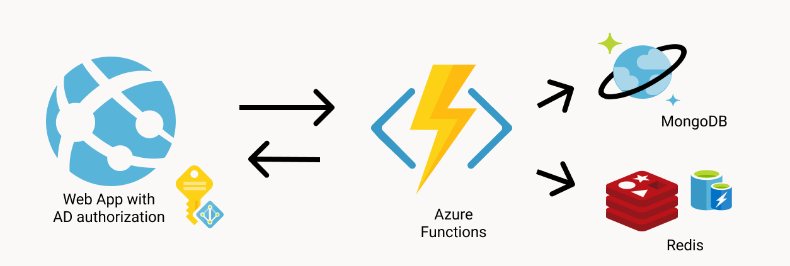

# Short10

*very simple and performative URL shortener.*

Built with NodeJS and ReactJS

---

### Features

- Built for Azure Active Directory
- Cache aside pattern, With Redis and MongoDB

### Prerequisites

- Azure Account

### Setup

- Create resources or Host Alternatives,

Cosmos DB for MongoDB
Azure cache for Redis
Azure Functions
- Fill (.env) Environment variable configurations

    .env in Functions
    .env in Web 

### Deploy

- Deploy Azure functions.
- Deploy a express server to Azure Web App and host the react Static files.
- Turn the Authorization with Your choice of Provider on Azure web App.
- Don't Forget to enable cors both sides.
  
  

#### Docs are a work in Progress

---

This tool was developed and is being used internally by Student Developers in [Microsoft Student Partners](http://studentpartners.microsoft.com) Program.